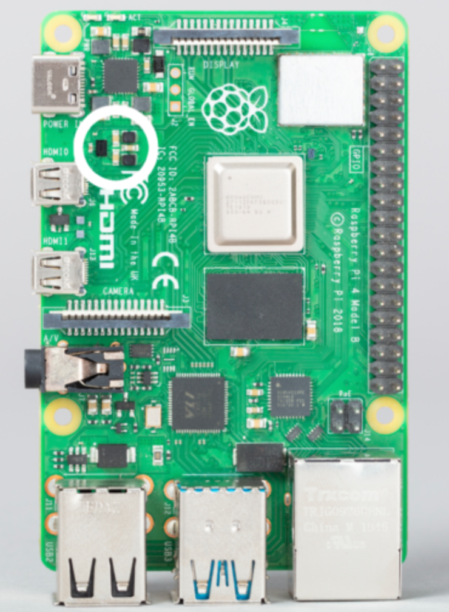
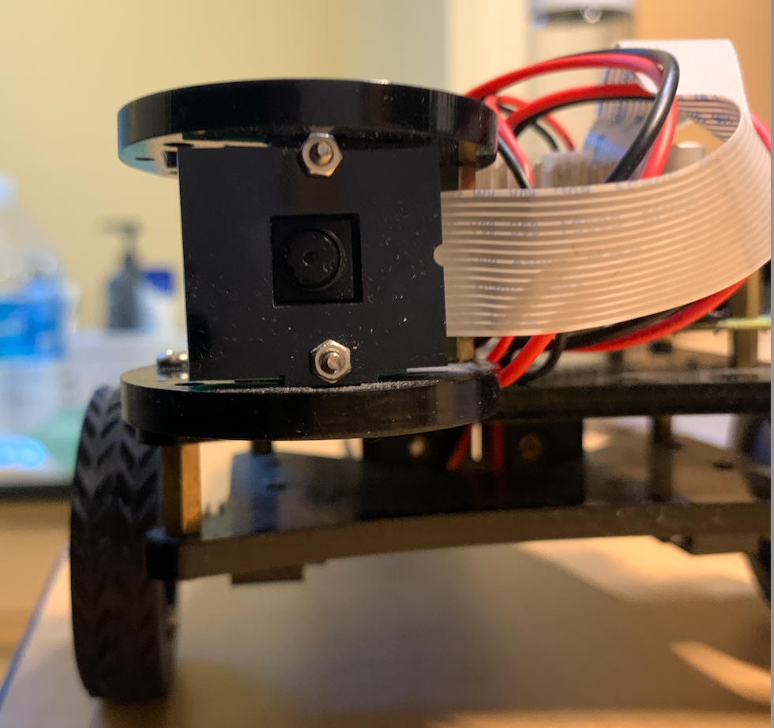
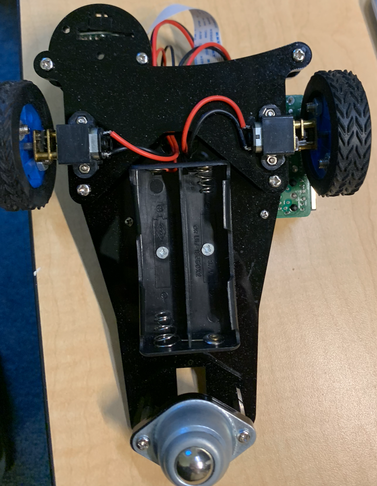

## Overview

This project aims to use opencv to track line for robot car

## Project Structure
```plaintext
Car_Line_Tracking/
│
├── src/
│   ├── One_Line_Tracking.py               
│   ├── motor.py    
│   ├── function.py  
│   ├── Forward.py
│   ├── Backward.py 
│   ├── Left.py 
│   ├── Right.py                       
│   └── model.py                         
│
└── README.md                             # Project overview and instructions
```

## Requirements

- Python 3.7+
- opencv
- RPi.GPIO

You can install the necessary packages using the following command:

```bash
pip install opencv-python 
```

## How to Run

### 1. Run Line Tracking 

Run car with one cmd:

```bash
python src/One_Line_Tracking.py
```
### 2. Hardware	
#### Control Board
Raspberry pi 4 B:<br>


Adeept Motor Hat V2:<br>


#### Robot Car
Robot car front:<br>


Robot car top:<br>


Robot car bottom:<br>


## Results
Follow Line Moving:

https://github.com/user-attachments/assets/ff69ae37-35f4-49bf-8366-5d5ad6ffc160


## Next Steps
- **AI Model Deploy:**
 Experiment with neural network architectures to improve car self drive performance.

## Contributing
Contributions are welcome! Please fork the repository and create a pull request to contribute to the project.

## License
This project is licensed under the MIT License.
